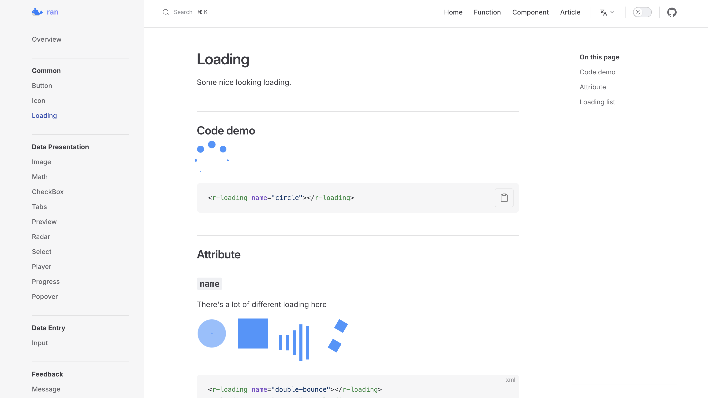
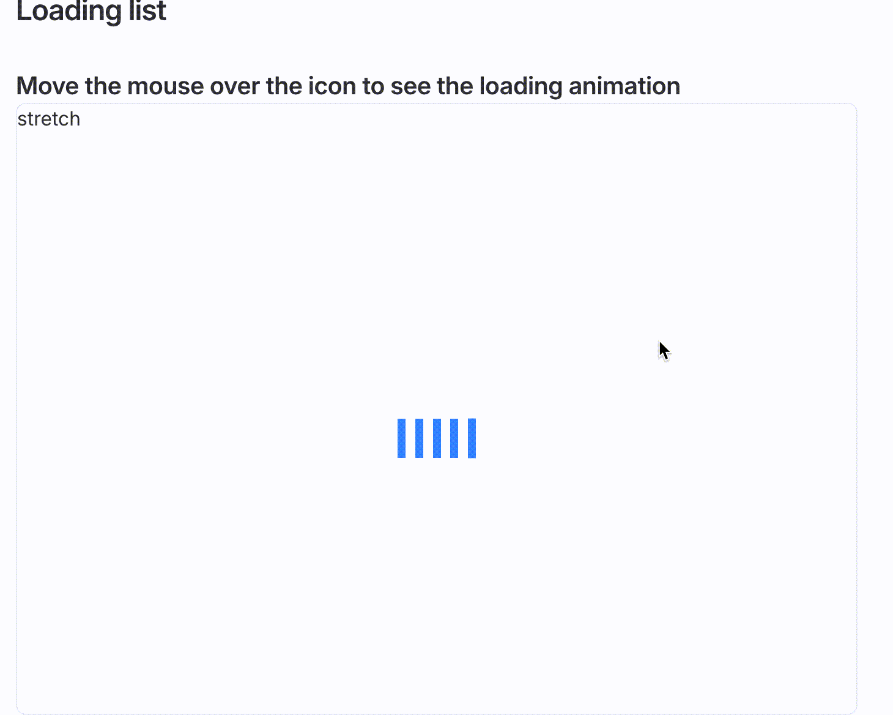

# 29 款精选 Loading，为网页添彩，让等待也成风景

`Loading` 是开发过程中很常见的场景，在 `Client/Server` 架构盛行的今天，客户端与服务器之间的数据交换往往需要短暂但关键的时间。这段空白期，若能用一个精心设计、引人入胜的 `Loading` 组件来填充，能极大缓解用户的等待焦虑，也能为应用增添一丝魅力。

但如何 **找到** 和 **使用** 就成了问题。

因此我收集并整理了 `29` 款各具特色的 `Loading` 样式，并封装成了易于集成的形式，希望能轻松地将它们融入自己的项目中，提升整体的用户体验。

本文主要包含以下几个部分：

- `Loading`组件的展示，有哪些效果
- 怎么使用：越简单越好，适用范围越大越好
- 怎么设计的：开放源码，讲述原理，大家都能看懂和学会。

如果大家觉得有所帮助，感谢点一个 `star`，如有不足之处，欢迎大家评论和反馈，一起学习交流。

- 完整代码：https://github.com/chaxus/ran
- `demo`文档：https://chaxus.github.io/ran/src/ranui/loading/

# 一。`Loading`列表

- 文档链接：https://chaxus.github.io/ran/src/ranui/loading/



为了方便展示，文档里有一个`Loading List`部分，把鼠标移动上去就能看到动画效果，鼠标移开就会暂停。



其中 **左上角** 会有每个`Loading`组件的名字，通过`name`属性即可展示不同的`Loading`:

```ts
<r-loading name="double-bounce"></r-loading>
<r-loading name="rotate"></r-loading>
<r-loading name="stretch"></r-loading>
<r-loading name="cube"></r-loading>
```
`name`属性的值，在每个`Loading`例子的左上角：


有些`Loading`效果，**暗黑模式**下效果更佳，可以在右上角切换 **主题颜色**：


一些暗黑模式下，`Loading`的效果：


# 二。如何使用

最简单的使用方法就是：

```
npm i ranui@latest --save
```

然后在项目中导入：

```
import 'ranui';
```

项目也提供了**分路径导入**：

```
import 'ranui/loading';
```

然后从文档里，找一个觉得还行的`Loading`效果，找到对应的`name`名字。
- 文档链接：https://chaxus.github.io/ran/src/ranui/loading/
编写代码：

```ts
<r-loading name="double-bounce"></r-loading>
<r-loading name="rotate"></r-loading>
<r-loading name="stretch"></r-loading>
<r-loading name="cube"></r-loading>
```

就引入完成啦

## 1.如何自定义颜色，动画，大小等等属性

在使用`Loading`组件的过程中，可能会遇到需要自定义颜色，大小，动画的情况。以上都属于样式的范畴，可以通过自定义样式的方式去处理。

在`webcompoents`组件中，会把样式放到`shadowRoot`中 (不是必须)。做到完全的样式隔离，不会被外界的样式干扰。同时也不会影响到外部的样式。

在这种情况下，自定义样式就需要一些特殊的方法：

- `CSS` 变量：

我们在项目中使用时，可以看到样式：


其中每一个`CSS`属性，都有一个`CSS`变量指代，所以，我们可以用`style`或者`class`的方式：

比如默认情况是蓝色：


- `style`的方式：

在`react`中，`style`必须是一个对象，所以：
```ts
<r-loading class="loading" style={{ '--loading-rotate-background': 'red' }} name="rotate"></r-loading>
```


但在原生环境中，`style`是一个字符串，所以：
```ts
<r-loading class="loading" style='--loading-rotate-background:red' name="rotate"></r-loading>
```

- `class`的方式：

```scss
// index.scss
.loading {
  -loading-rotate-background: red;
}
```
在 `index.tsx`文件中：
```tsx
    <r-loading class="loading" name="rotate"></r-loading>
```
因此，也能看到结果：


也可以采用另一个方式，我们可以在页面元素上看到，元素有一个`part`属性：


所以我们可以在`CSS`中这样使用：

```scss
// index.scss

.loading {
  &::part(rotate) {
    background: red;
    width: 100px;
    height: 100px;
  }
}

```

在`index.tsx`中：

```tsx
<r-loading class="loading" name="rotate"></r-loading>
```

然后就会发现，也生效了。


以上是原生`W3C`标准提供的`CSS scoped`方案，适合所有遵循`W3C`标准的框架。用`JavaScript`写的框架都可以这么用。

## 2.在`typescript`项目中如何使用呢（类型问题）

我们在`typescript`项目中，可能会遇到这样的问题：


> 类型“JSX.IntrinsicElements”上不存在属性“r-loading”。

这是因为`JSX`类型上，确实没有定义这些元素，对此，我会对`JSX`类型进行扩展：


这里为了简单定义，用`any`做了`hack`。


如果是直接导入的方式：
```
import 'ranui'
```
会自动导入类型文件，就不会有这个问题。

如果是分路径导入的，则肯定不会导入类型文件了，需要手动导入一下，比如按路径导入`dist`目录下的`index.d.ts`:

```ts
import 'ranui/dist/index.d.ts
```

# 三。架构设计

为了避免出现 `vue2` 升级 `vue3` 或其他框架变更可能引发的组件库适配问题，导致公司积累了许久的组件库需要重新调整，这里采用了原生的 `webcompoents` 去开发。期望做到一次开发，永久受益。

同时期望能支持`vue`，`react`，`preact`,`solidjs`等各种框架。毕竟工作一段时间就会发现，大部分公司都是`vue`和`react`等框架并存的状态。有的项目是用`vue`,有的是用`react`。

同时由于 `Loading` 组件也足够简单，也不需要采用`Stencil`等开发框架，直接原生`JS`操作即可，可以最小化文件代码体积。

关于 `webcompoents`的基础知识，可以参考：

- [从零开始手写基于 Web Components 组件](https://juejin.cn/post/7170219296226803725)

## 1. 避免 SSR 报错

由于`webcompoents`开发需要依赖`HTMLElement`，在`SSR`的情况下会直接抛出`Error`,因此需要额外的处理下：

```ts
export const HTMLElementSSR = (): { new (): HTMLElement; prototype: HTMLElement } | null => {
  if (typeof document !== 'undefined') {
    return HTMLElement;
  }
  return null;
};
```
在将`Loading`去依赖这个函数，即可

```ts
export class Loading extends (HTMLElementSSR()!) {
  contain: HTMLDivElement;
  static get observedAttributes(): string[] {
    return ['name'];
  }
  constructor() {
    super();
    this.contain = document.createElement('div');
    this.contain.setAttribute('class', 'ran-loading');
    const shadowRoot = this.attachShadow({ mode: 'open' });
    shadowRoot.appendChild(this.contain);
  }
  connectedCallback(): void {

  }
  disconnectCallback(): void {

  }
  attributeChangedCallback(k: string, o: string, n: string): void {

  }
 }
```
## 2.设计 Loading 组件的属性

### (1). name 属性

首先，`Loading`组件肯定需要一个类型属性，去区别不同的`Loading`。我先将这个属性设置为`name`:

根据不同`name`属性的值，去生成不同的`Loading`组件，方便使用和扩展：

首先定义`name`属性的枚举：
```
export enum NAME_AMP {
  DOUBLE_BOUNCE = 'double-bounce',
  ROTATE = 'rotate',
  STRETCH = 'stretch',
  CUBE = 'cube',
  DOT = 'dot',
  TRIPLE_BOUNCE = 'triple-bounce',
  SCALE_OUT = 'scale-out',
  CIRCLE = 'circle',
  CIRCLE_LINE = 'circle-line',
  SQUARE = 'square',
  PULSE = 'pulse',
  SOLAR = 'solar',
  CUBE_FOLD = 'cube-fold',
  CIRCLE_FOLD = 'circle-fold',
  CUBE_GRID = 'cube-grid',
  CIRCLE_TURN = 'circle-turn',
  CIRCLE_ROTATE = 'circle-rotate',
  CIRCLE_SPIN = 'circle-spin',
  DOT_BAR = 'dot-bar',
  DOT_CIRCLE = 'dot-circle',
  LINE = 'line',
  DOT_PULSE = 'dot-pulse',
  LINE_SCALE = 'line-scale',
  TEXT = 'text',
  CUBE_DIM = 'cube-dim',
  DOT_LINE = 'dot-line',
  ARC = 'arc',
  DROP = 'drop',
  PACMAN = 'pacman',
}
```
不同的枚举，对应不同的`Loading`:
```ts
  createLoading = (): void => {
    this.contain.innerHTML = '';
    const NAME_MAP: Record<NAME_AMP, () => void> = {
      [NAME_AMP.STRETCH]: this.stretchLoading,
      [NAME_AMP.ROTATE]: this.rotateLoading,
      [NAME_AMP.DOUBLE_BOUNCE]: this.doubleBounceLoading,
      [NAME_AMP.CUBE]: this.cubeLoading,
      [NAME_AMP.DOT]: this.dotLoading,
      [NAME_AMP.TRIPLE_BOUNCE]: this.tripleBounceLoading,
      [NAME_AMP.SCALE_OUT]: this.scaleOutLoading,
      [NAME_AMP.CIRCLE]: this.circleLoading,
      [NAME_AMP.CIRCLE_LINE]: this.circleLineLoading,
      [NAME_AMP.SQUARE]: this.squareLoading,
      [NAME_AMP.PULSE]: this.pulseLoading,
      [NAME_AMP.SOLAR]: this.solarLoading,
      [NAME_AMP.CUBE_FOLD]: this.cubeFoldLoading,
      [NAME_AMP.CIRCLE_FOLD]: this.circleFoldLoading,
      [NAME_AMP.CUBE_GRID]: this.cubeGridLoading,
      [NAME_AMP.CIRCLE_TURN]: this.circleTurnLoading,
      [NAME_AMP.CIRCLE_ROTATE]: this.circleRotateLoading,
      [NAME_AMP.CIRCLE_SPIN]: this.circleSpinLoading,
      [NAME_AMP.DOT_BAR]: this.dotBarLoading,
      [NAME_AMP.DOT_CIRCLE]: this.dotCircleLoading,
      [NAME_AMP.LINE]: this.lineLoading,
      [NAME_AMP.DOT_PULSE]: this.dotPulseLoading,
      [NAME_AMP.LINE_SCALE]: this.lineScaleLoading,
      [NAME_AMP.TEXT]: this.textLoading,
      [NAME_AMP.CUBE_DIM]: this.cubeDimLoading,
      [NAME_AMP.DOT_LINE]: this.dotLineLoading,
      [NAME_AMP.ARC]: this.arcLoading,
      [NAME_AMP.DROP]: this.dropLoading,
      [NAME_AMP.PACMAN]: this.pacmanLoading,
    };
    const handler = NAME_MAP[this.name];
    handler && handler();
  };
```
在自定义元素被插入到 DOM（文档对象模型）文档树时，执行`createLoading`函数，生成不同的`Loading`。
```ts
  connectedCallback(): void {
    this.createLoading();
  }
```
同时，还需要处理，在`name`属性改变时，需要移除当前的`Loading`组件，添加当前`name`属性对应的`Loading`:
```ts
 attributeChangedCallback(k: string, o: string, n: string): void {
    if (o !== n) {
      if (k === 'name') {
        this.createLoading();
      }
    }
  }
```

## 3.设计导入的方式

这里设计了两种导入方式：

```
import 'ranui';
```
或者

```
import 'ranui/loading';
```
导入方式上，采用了分路径导入的方式。通过`vite`进行多入口构建。确保每个路径只导入当前的组件。

**按路径导入有什么好处呢？**

由于`import`语法是在静态分析阶段进行导入的，因此，分路径导入能显著减少导入的文件体积。

就算文件中大量的`import`虽然没有用到，但仍然会实际加载和导入。这点跟`require`不同，`require`才是运行时导入。

至于`tree shaking`，这是在`build`阶段，构建工具进行依赖分析，拆分出没有用到的部分，不进行打包构建。

但对于某些**全局的立即执行函数**，`tree shaking`并不能直接分析出会不会用到。比如：

```ts
const setTitle = () => {
    document.title = '这是标题'
}
setTitle()
```

这种情况，没有任何导出，也就不会有任何依赖关系链，但实际上，仍然有作用。这种类似的情况，`tree shaking`难以发挥作用。但这是正常的，如果这种也被删除了，项目就有问题了。

所以，提供分路径导入的方式，是最好的减少体积的方式。

但`import 'ranui';`这样导入也是没有问题的，没有使用到的部分，在项目最终构建打包时，会通过`tree shaking`自动帮我们删除没有用的部分。

# 最后：

- 完整代码：https://github.com/chaxus/ran
- `demo`文档：https://chaxus.github.io/ran/src/ranui/loading/


